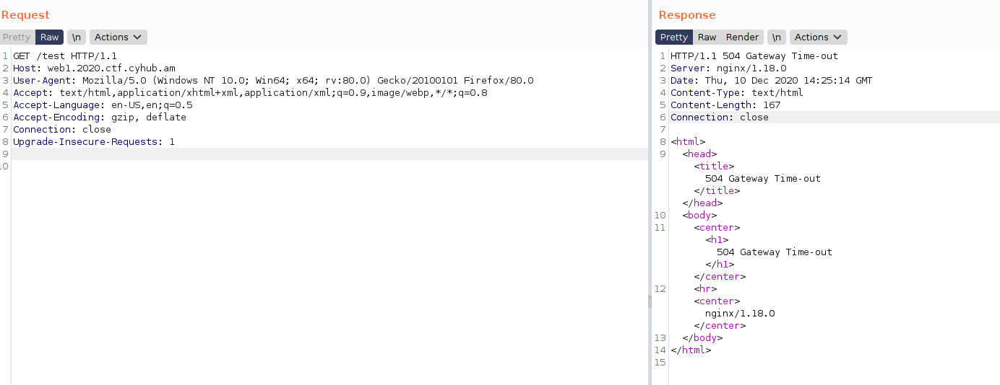
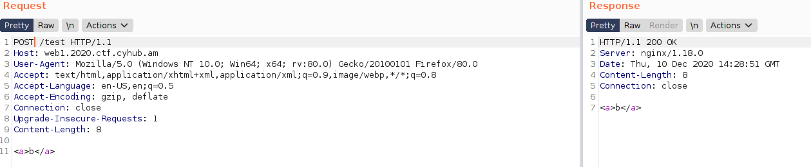
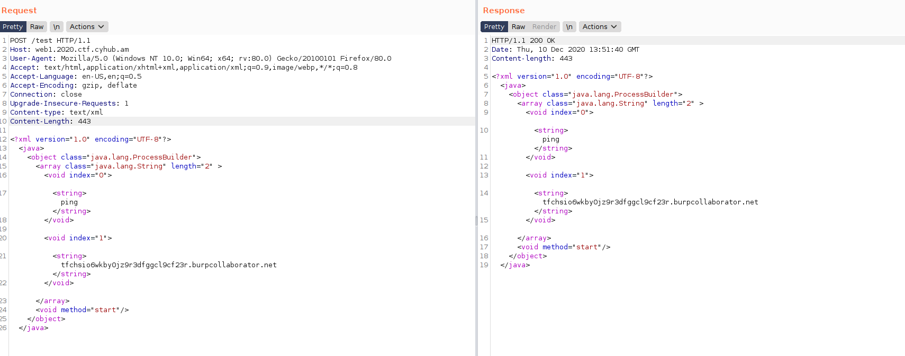
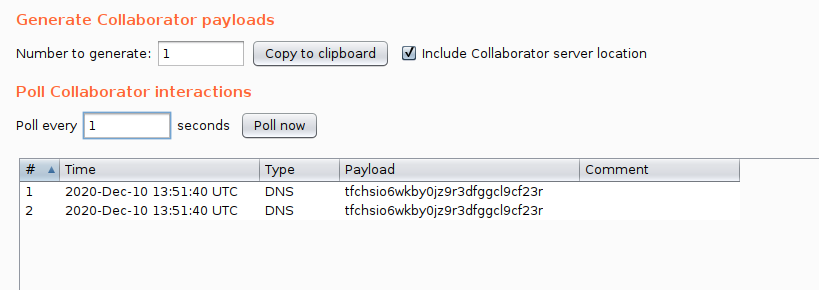

hey
For a beginning, you can see that with the task there is a provided WSDL file  http://files.2020.ctf.cyhub.am/game_materials/wsdl.wsdl. 
If you get request methods from the WSDL file, you can understand that there are GET/POST requests with an XML body.
So, the web has an IP address, after that we can brute force the directories to find some hidden services. Using dirb or some else tool, you can find out that 

http://web1.2020.ctf.cyhub.am/test 

will send Gateway timeout error (504) instead of Not found (404).

So, as we know that there is some XML parser on the backend, we need to send a simple POST request to /test with <a>b</a> XML body.

We got <a>b</a> in respose.

The most popular attack to web services that parse XML is XML serialization.

https://github.com/GrrrDog/Java-Deserialization-Cheat-Sheet#xmlencoder-xml

Using the classic payload for XML decoder/encode we can send the following request to the server and get RCE on them. 

After that, we just need to read a flag from the server.

Tnx.
